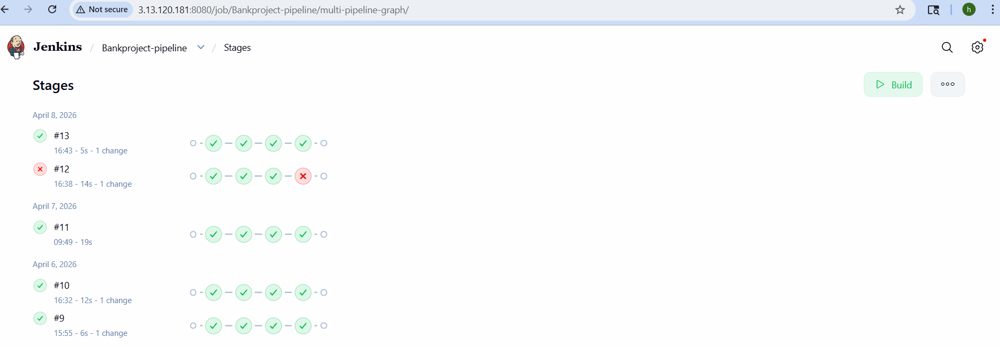
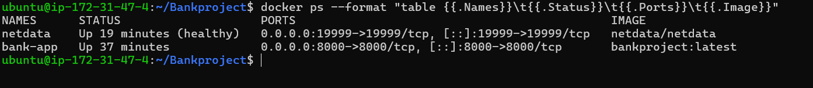
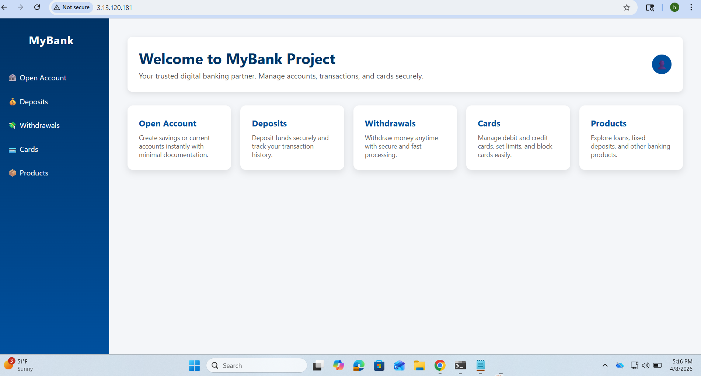

# 🏦 BankProject - CI/CD & Cloud Infrastructure

A full-stack banking application deployed on **AWS EC2** using a professional DevOps pipeline. This project showcases automated container deployment, cloud database management, and infrastructure monitoring.

## 🏗️ Architecture Overview
* **Cloud Provider:** AWS (EC2 t3.micro & RDS PostgreSQL)
* **Containerization:** Docker (App, Monitoring, & Image Management)
* **Web Server:** Nginx acting as a Reverse Proxy
* **CI/CD Pipeline:** Jenkins with GitHub Webhooks
* **Monitoring:** Netdata (Real-time resource tracking)

---

## 📸 Project Documentation
> **Note:** The following screenshots document the live, healthy infrastructure deployed in April 2026.

### **1. Cloud Infrastructure (AWS)**
Management of scalable compute resources and managed database services.
| EC2 Instance (Jenkins/App) | RDS Database (PostgreSQL) |
| :--- | :--- |
|  |  |

### **2. Automated CI/CD Pipeline (Jenkins)**
Every code push triggers an automated build, test, and deployment flow.


### **3. Artifact & Infrastructure Validation**
Validation of the successfully built Docker image and enforced container resource limits.
| Docker Image Build | Resource Governance (CLI) |
| :--- | :--- |
|  |  |

### **4. Live Application**
The banking interface served securely via Nginx.


---

## 🚀 Deployment Pipeline
The project utilizes a **Jenkinsfile** that automates the lifecycle:
1.  **Build:** Packages the Python application into a Docker image.
2.  **Test:** Verifies connectivity between the container and AWS RDS.
3.  **Deploy:** Performs a rolling update, removes stale containers, and enforces resource limits (`--memory=512m`) for stability.

---

## 🌐 Security & Networking
* **Reverse Proxy:** Nginx redirects traffic from Port 80 to the internal Docker port 8000.
* **Security Groups:** Port 8000 is restricted; only Port 80 (Web) and Port 19999 (Monitoring) are accessible to the public.

---

## 🛠️ Local Setup
To run a local copy of this container:
```bash
docker build -t bankproject .
docker run -d -p 8000:8000 --name bank-app bankproject


